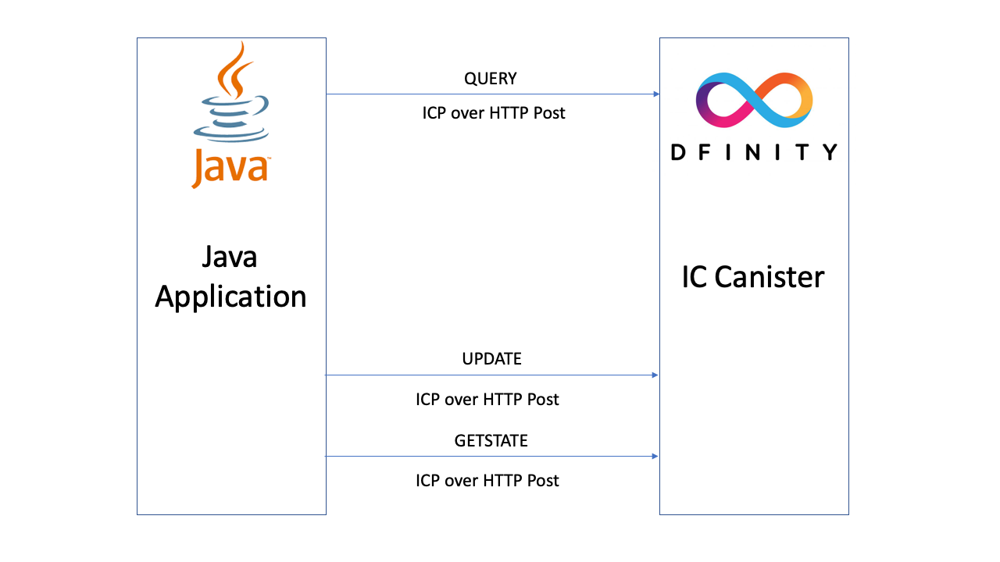

# Overview

## Welcome to IC4J

Welcome to IC4J!&#x20;

IC4J is an Agent for the Internet Computer (IC4J) which is an Adapter that has a set of native Java libraries to allow remote connection of other systems to the Internet Computer Environment.

This is where you will find all the documentation to get up and running with the IC4J Application Programming Interface (API).

To learn more about the Internet Computer platform, please visit Dfinity website. [https://dfinity.org](https://dfinity.org)

_"The Internet Computer is created by the Internet Computer Protocol (“ICP”), which has formed the world’s first web-speed, web-serving public blockchain. The Internet Computer is self-governing and can grow its capacity as required. It combines special node machines run en masse by independent data centers all around the world. Like all blockchains, it is unstoppable, and the code it hosts is tamperproof."_





The IC4J code is the Java implementation of the Internet Computer Interface protocol.



IC4J library is using Dfinity Rust Agent as an inspiration, using similar package structures and naming conventions.



The Internet Computer uses two Method types to execute smart contract code in the canister; UPDATE and QUERY.&#x20;

UPDATE method is mutable, allowing the user to change data on the chain.&#x20;

QUERY method is immutable, and does not allow the user to change the data.

&#x20;IC4J uses a native ICP binary protocol so that the Java code can participate in chain updates and query canister data without using any gateway or bridge.&#x20;

This way the communication between the Java application and the IC canister is secure and tamperproof.&#x20;

IC4J source code with samples can be found on Github.



## Want to jump right in?

Jump in to the quick start docs section and make the first request:


[quick-start.md](quick-start.md)


## Want to deep dive?

Dive a little deeper and start exploring our API reference to get an idea of everything that's possible with the API:


[api-reference](reference/api-reference/)


